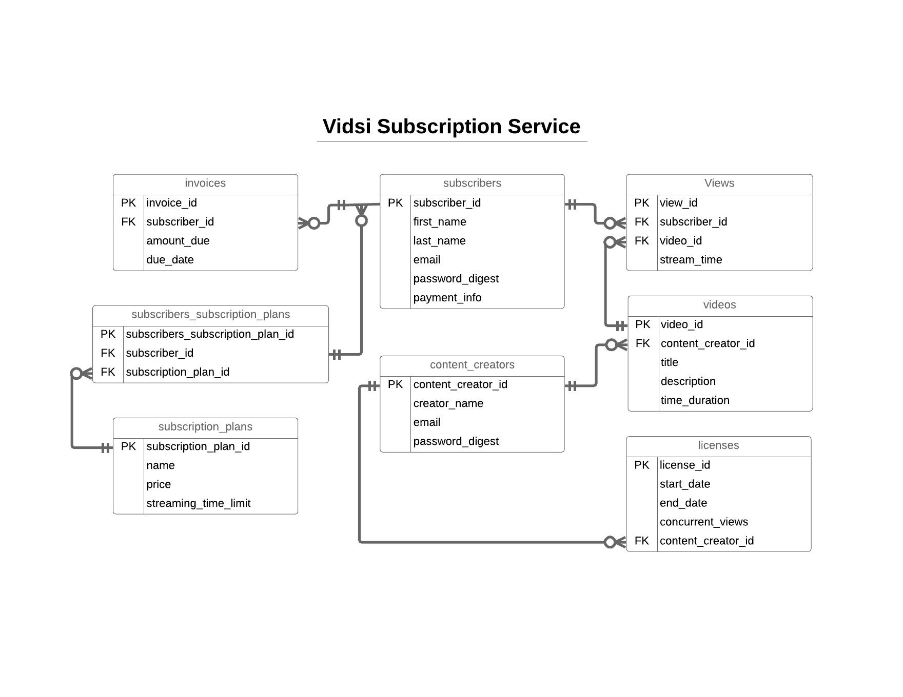

### Vidsi

“Vidsi” is a new video streaming service you are building for a startup company.
+	Subscribers sign up for free and receive 2 hours of free streaming.
+	For paid subscribers, streaming limits are based on plan tier.
+	There are currently 3 tiered subscription plans - but they may change in the future
+	There’s a catalog of videos to stream that are licensed from different content providers.
+	Subscribers stream videos and we need to store information about what’s being streamed
+	We need to generate monthly invoices for subscribers that can be paid by credit card on file or by check.
+	For subscribers charged by credit card we need to store payment information (you can assume security and PCI compliance don’t exist - you can store credit card numbers to charge).
+	Licenses with content providers only allow for a certain number of concurrent subscribers to watch a given video.

#### Entity Relationship Diagram


#### Instructions
+ Install SQLite3
+ Navigate to project directory
+ run command in terminal: `cat import_db.sql | sqlite3 vidsi.db`
+ run command in terminal: `ruby main.rb`

#### Class Methods
```ruby
    # SQL Query that returns the top 20 video/user pairings.
    # Show which videos have been most re-watched by a single user.
    def self.get_user_video_view_count
        # return value will be an array of hashes
        VidsiDBConnection.instance.execute(<<-SQL)
            SELECT first_name || ' '  || last_name AS name, title, COUNT(*) num_views
            FROM subscribers
                INNER JOIN views
                    ON views.subscriber_id = subscribers.id
                INNER JOIN videos
                    ON videos.id = views.video_id
            GROUP BY name, title
            ORDER BY num_views DESC
            LIMIT 20
        SQL
    end

    # Algorithm: find subscribers who haven't paid their invoices and need to be sent a cancellation notice.
    def self.get_unpaid_subscribers
        # return value w
        unpaid_subscribers = VidsiDBConnection.instance.execute(<<-SQL)
            SELECT first_name || ' '  || last_name AS name, email, SUM(invoices.amount_due - invoices.amount_paid) AS amount_owed
            FROM subscribers
                INNER JOIN invoices
                    ON invoices.subscriber_id = subscribers.id
            WHERE invoices.amount_due - invoices.amount_paid != 0
            GROUP BY subscribers.id
        SQL

        unpaid_subscribers.each do |subscriber|
            send_cancellation_notice(subscriber['email'])
        end
    end

    def self.send_cancellation_notice(subscriber_email)
        # code that sends cancellation notice to the given email
    end
```